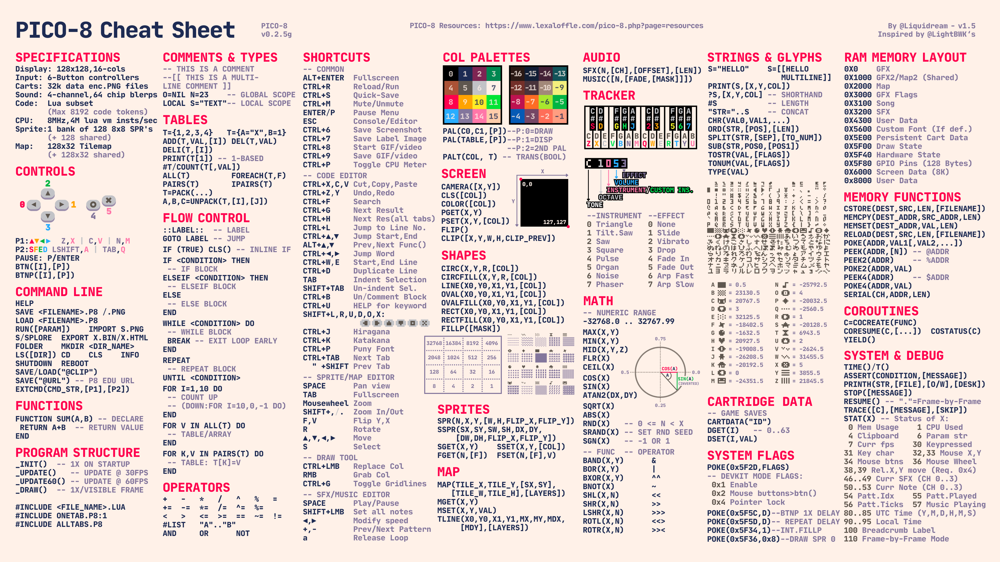
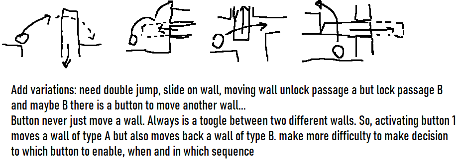
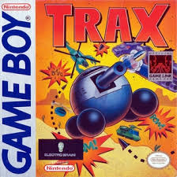

# temppico8game

control + 7 to take picture

export name.p8.png

# TO DO

## Block Shifter

Summary:
Metrodvania/Puzzle style there I unlock passages by activating buttons that moves walls (rectangles) up, down, left or right

Feeling:
- It should feel good to move around the map. Nice controls and jump
- not a typical platform. you can only jump and double jump (later on the game)
- focus is a puzzle but the whole map is a puzzle. move walls and validate if a wall can be moveable. example: maybe a wall is blocked by another wall. Use mset/mget for collision detection and also store x,y,type in a array to keep track when activating/deactivating buttons

Controls:

- Left/right to move
- x to jump
- x in the air to double jump (unlock later on the game)
- o to interact with enviroment, activate button

export blockshifter.p8.png

## Trax like game

export trax.p8.png

Make a game like game boy Trax game

Rougue like:
- Every time you play, the tanks, helicopters, 2 extra weapon, bridge and fuel tank are positioned in different places.

Randon map:
- Some random bridges are destroyed
- 2 extra weapons and few fuel tanks are randomly placed 

Mechanics:
- No save. Every time you die, you start from begining
- you have a tank fuel. there are only few gasoline in the map. The more you move, you spend more fuel. so, don't waste fuel.
- you have only one life. You hit and game restart.
- later on the game there are 2 extra weapons hidden: triple shoot or bomb (when hit something, it hits all close enemies as well)
- 2 Different enemies: tanks (slow movement but fast shoot) and helicopter (fast movement but slow shoot). 1 hit and you die. Dodge, hide and shoot it back. 1 hit and they die.

- Add a song like the the music from the original game

https://www.youtube.com/watch?v=bD2y1mv3be0&ab_channel=WorldofLongplays

## Implement pico8 to dos

https://www.lexaloffle.com/bbs/?uid=92611

